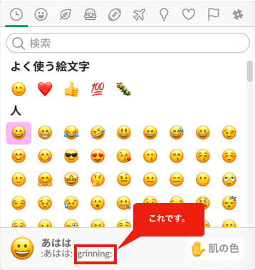

## Botkit

### Controller系

#### メッセージ受信
```
//「こんにちは」、「こんちは」と送られた時
controller.hears(['こんにちは', 'こんちは'], 'direct_message,direct_mention,mention', function(bot, message) {
}
```

メッセージ受信には```controller.hears()```を使用します。  
第一引数に起動メッセージ、第二引数にイベント種別を設定します。  
イベント種別は以下の通りです。

|イベント|概要|
|:--|:--|
|direct_message|botに対し直接メッセージを送付した場合|
|direct_mention|メッセージを「@ボット名」を先頭で送信した場合|
|mention|メッセージに「@ボット名」が含まれている場合|

上記の例だと「こんにちは」「こんちは」という文字が含まれたメッセージが送られた場合、  
```function(bot, message)```を実行します。  
第一引数"bot"にはbotオブジェクトが、第2引数"message"には送られたメッセージなどが入った  
messageオブジェクトが入ります。

また、```controller.hears()```の第一引数には正規表現も使用でき
```
//「わたしは〇〇と言います」というメッセージが送られてきた場合
controller.hears(['わたしは(*)と言います'], 'direct_message,direct_mention,mention', function(bot, message) {

  //(*)の部分を抜き出す。
  var name = message.match[1];
}
```
のようにすることで特定の文章内の特定の文字を抜き出すこともできます。  
<div style="page-break-before:always"></div>

  　
#### ユーザー情報の保存
```
controller.hears(['私は(.*)といいます'], 'direct_message,direct_mention,mention', function(bot, message)

  //(*)の部分を抜き出す。
  var name = message.match[1];

  // ユーザー情報取得
  controller.storage.users.get(message.user, function(err, user) {

    //userが設定されていない場合、設定
    if (!user) {
      user = {
        id: message.user
      };
    }
    user.name = name;

    //ユーザー保存
    controller.storage.users.save(user, function(err, id) {
      bot.reply(message, 'わかりました。今から ' + user.name + ' と呼びます');
    });
  });
});
```

```controller.storage.users.get()```  を使用してユーザー情報を取得し、```controller.storage.users.save()```  
を使用しユーザーの保存ができます。   


<div style="page-break-before:always"></div>　


### Bot系

#### リアクション送信
```
controller.hears(['こんにちは', 'こんちは'], 'direct_message,direct_mention,mention', function(bot, message) {

    //リアクションを送信
    bot.api.reactions.add({
        timestamp: message.ts,
        channel: message.channel,
        name: 'grinning',
        //エラー処理
    }, function(err, res) {
        if (err) {
            bot.botkit.log('Failed to add emoji reaction :(', err);
        }
    });
});
```
リアクションとはslackのスタンプのようなものです。  
リアクションは```bot.api.reactions.add()```を使用します。  

```timestamp``` にはリアクションのタイムスタンプが、```channel```にはslackのチャンネルが  
```name``` にはslackの英語のリアクション名が入ります。   

  

<div style="page-break-before:always"></div>　


#### メッセージ送信
```
controller.hears(['こんにちは', 'こんちは'], 'direct_message,direct_mention,mention', function(bot, message) {

  //メッセージ送信
  bot.reply(message, 'こんにちは.');
});
```
メッセージの送信は```bot.reply()```を使用します。  
第一引数にメッセージオブジェクト、第二引数に送信するメッセージを設定します。  

メッセージは "こんにちは:リアクション名:" のように文字とリアクションを組み合わせて  
送ることもできます。


#### 会話による条件分岐
```
controller.hears(['ラーメン'], 'direct_message,direct_mention,mention', function (bot, message) {

    bot.reply(message, 'ラーメンいいですよね:grin:');

    // 会話を開始します。
    bot.startConversation(message, function (err, convo) {

        // convo.ask() で質問をします。
        convo.ask('何味が一番好きですか！', [
            {
                pattern: '醤油|しょうゆ', // マッチさせる単語
                callback: function (response, convo) {

                    //マッチした時の処理
                    convo.say('オーソドックスでいいですね！私もよく食べます。'); // メッセージを送信。
                    convo.next(); // 会話を終了します。
                }
            },
            {
                pattern: '味噌|みそ',
                callback: function (response, convo) {
                    convo.say('北海道で食べたくなりますね！私も好きです。');
                    convo.next();
                }
            },
            {
                pattern: '塩|しお',
                callback: function (response, convo) {
                    convo.say('あっさりしていいですよね！たまに食べたくなります。');
                    convo.next();
                }
            },
            {
                pattern: 'とんこつ|豚骨',
                callback: function (response, convo) {
                    convo.say('豚さん。。');
                    convo.next();
                }
            },
            {
                default: true,
                callback: function (response, convo) {

                    //どのパターンにもマッチしない時の処理
                    convo.say('通ですね！私まだ食べたことがないです。');
                    convo.next();
                }
            }
        ]);

    })

});
```
会話をするには```bot.startConversation()```を使用します。  
引数の```convo```には会話用オブジェクトが入っています。  
```convo.ask()``` で質問を送り、```pattern```に一致させたい文字列を設定します。  
回答に```pattern```に設定した文字列が含まれていた場合、対応する```callback```内の関数が実行されます。  
```convo.say()``` でメッセージを送信し、上記にはありませんが```convo.repeat()```を実行すると再度質問を送ります。  
```convo.next()``` で会話を進めます(repeatが設定されていれば、再度質問を送り、されていなければ終了する)  


<div style="page-break-before:always"></div>　


### Cron

#### 定期的に実行
```
// cron作成
var cron = new CronJob({
  //1分おきに実行
  cronTime: '*/1 * * * *',
  onTick: function() {

    //メッセージ送信
    bot.say({
      channel: 'general',
      text: 'hello',
      username: 'bot',
      icon_url: ''
    }, function(err) {
      if (err) {
        bot.botkit.log(err);
      }
    });
  },
  start: false,
  timeZone: 'Asia/Tokyo'
});

//cron開始
cron.start();
```
定期的に実行するにはcronオブジェクトを作成します。  
```cronTime```には実行する頻度を設定し、```onTick```  に実際に行う処理を記述します。    
```cronTime```  は下記のサイトを参考に設定してみてください。
https://qiita.com/katsukii/items/d5f90a6e4592d1414f99

<div style="page-break-before:always"></div>　


### API

#### Docomo雑談API

```
requestDialogApi("こんにちは", function(res){

  //APIのレスポンスをメッセージ送信
  bot.reply(message, res);
});
```
Docomo雑談APIは発話テキストを渡すと、それに対する適切な受け答えを返却してくれるAPIです。
第一引数に発話テキストを渡し、その受け答えが```function(res)```のresに格納されています。

#### DocomoQ&A API
```
requestQAApi("アメリカの大統領は?", function(res){

  //APIのレスポンスをメッセージ送信
  bot.reply(message, res);
});
```
DocomoQ&A APIは質問をテキストで渡すと、それに対する回答を返却してくれるAPIです。
第一引数に質問テキストを渡し、その回答が```function(res)```のresに格納されています。

#### Wiki API
```
wikiApi('テクノモバイル', function(res){

  //APIのレスポンスメッセージを送信
  bot.reply(message, res);
});
```
Wiki APIは単語を渡すと、それに対するWikiの見出しを返却してくれるAPIです。  
第一引数に調べる単語を渡し、その回答が```function(res)```のresに格納されています。  
wiki APIは検索が弱いのか結果が返ってこないことも多々あります。
